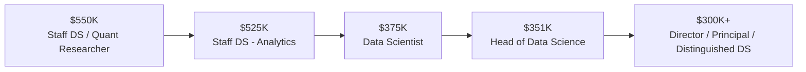
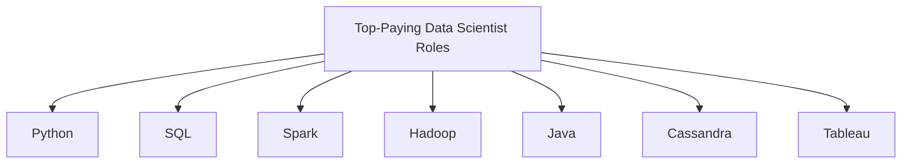
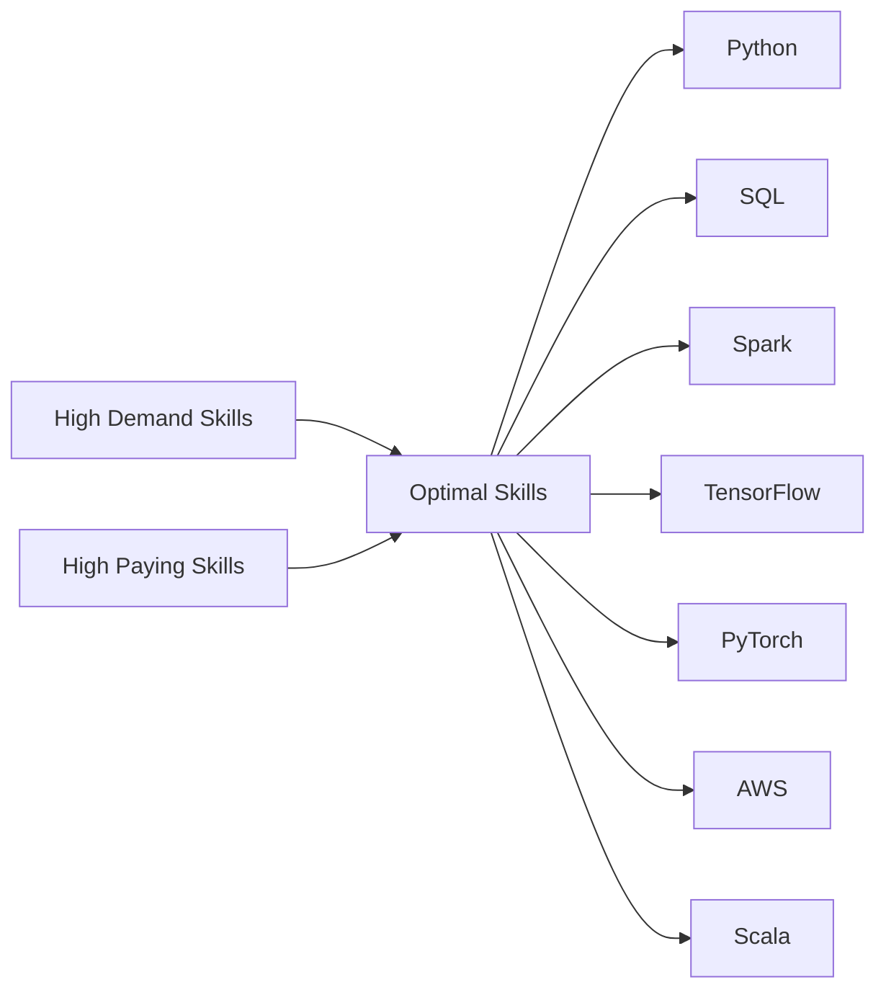

---

# Data Scientist Job Market Analysis (SQL) 📊

## Introduction

This project analyzes the **Data Scientist job market** using SQL to identify:

* The **highest-paying Data Scientist roles**
* Skills required for **top-paying positions**
* Skills that are **high in demand**, **high paying**, and therefore **optimal to learn**

The project demonstrates strong **SQL proficiency**, **analytical reasoning**, and the ability to transform raw job posting data into **actionable insights for recruiters and candidates**.

---

## Background

Data Scientist compensation varies significantly based on:

* Seniority level
* Skill specialization
* Market demand
* Role flexibility (remote vs on-site)

Understanding these factors helps:

* **Recruiters** benchmark compensation and identify skill gaps
* **Candidates** prioritize learning paths that maximize employability and salary growth

Only roles with **explicit salary data** are used to ensure analytical accuracy.

---

## Tools I Used 🛠️

* **SQL (PostgreSQL syntax)**

  * Common Table Expressions (CTEs)
  * Multi-table joins
  * Aggregations (`COUNT`, `AVG`)
  * Ranking and filtering
* **Relational datasets**

  * Job postings
  * Company metadata
  * Skill-to-job mappings
  * Skill reference tables

---

## Key Skills Demonstrated ⭐

### Technical Skills

* Advanced SQL (CTEs, JOINs, GROUP BY, ORDER BY)
* Relational data modeling (fact & dimension tables)
* Demand and compensation aggregation

### Analytical & Business Skills

* Labor market analysis
* Compensation benchmarking
* Demand vs value optimization

### Professional Skills

* Clear technical documentation
* Recruiter-focused insight communication
* Portfolio-ready GitHub presentation

---

## The Analysis 🔍

---

### 1. Top-Paying Data Scientist Jobs 💰

#### Top 10 Highest-Paying Roles (Remote)

#### Insights

* Senior and leadership roles dominate top compensation
* Quantitative and business analytics roles command premium salaries
* All top-paying roles are fully remote
* Compensation increases sharply with **seniority and specialization**

---

### 2. Skills Required for Top-Paying Jobs

#### Insights

* **Python and SQL are universal requirements**
* High-paying roles expect full-stack data capabilities
* Strong overlap between data engineering, analytics, and backend systems

---

### 3. Most In-Demand Data Scientist Skills

#### Demand Ranking by Job Count

| Skill   | Number of Job Postings |
| ------- | ---------------------: |
| Python  |                114,016 |
| SQL     |                 79,174 |
| R       |                 59,754 |
| SAS     |                 29,642 |
| Tableau |                 29,513 |

#### Insights

* Python and SQL dominate market demand
* R remains relevant for analytical roles
* High demand ensures employability, not necessarily higher pay

---

### 4. Highest-Paying Skills

#### Salary-Driven Ranking

| Skill    | Average Salary (USD) |
| -------- | -------------------: |
| Asana    |             $215,477 |
| Airtable |             $201,143 |
| RedHat   |             $189,500 |
| Watson   |             $187,417 |
| Elixir   |             $170,824 |

#### Insights

* Niche and enterprise tools command higher salaries
* These skills appear less frequently but indicate specialized roles
* Salary is driven more by scarcity than popularity

---

### 5. Most Optimal Skills (High Demand + High Pay) 🎯

#### Optimal Skill Summary

| Skill      | Job Count | Avg Salary |
| ---------- | --------: | ---------: |
| Python     |     4,312 |   $138,049 |
| SQL        |     3,151 |   $138,430 |
| Spark      |       946 |   $144,399 |
| TensorFlow |       641 |   $143,440 |
| PyTorch    |       564 |   $145,989 |
| AWS        |     1,016 |   $138,861 |
| Scala      |       381 |   $145,056 |
| Go         |       316 |   $147,466 |

#### Insights

* Python and SQL sit firmly in the **high-demand / high-pay** category
* Machine learning frameworks and distributed systems boost compensation
* Best strategy: **strong fundamentals + targeted specialization**

---

## What I Learned

* Seniority and specialization influence salary more than tool count
* High demand ensures job stability; specialization drives pay growth
* SQL CTEs improve clarity and maintainability
* Correct join logic is essential for accurate analytics

---

## Conclusions

This project demonstrates the ability to:

* Perform advanced SQL analysis on real-world datasets
* Identify labor-market trends in skills and compensation
* Communicate insights clearly to technical and non-technical audiences

**Recruiter takeaway:**
This repository showcases strong SQL fundamentals, business-oriented analytical thinking, and professional documentation suitable for portfolio review.

---

## Future Enhancements

* Interactive dashboard (Tableau / Power BI)
* Time-series salary trend analysis
* Role comparison (Data Analyst vs Data Scientist)
* Geographic compensation breakdown

