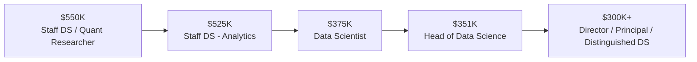
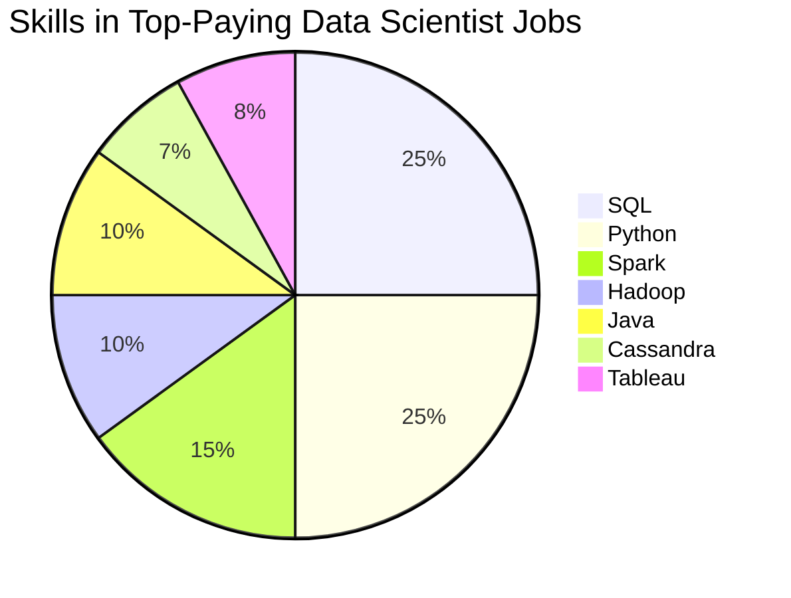
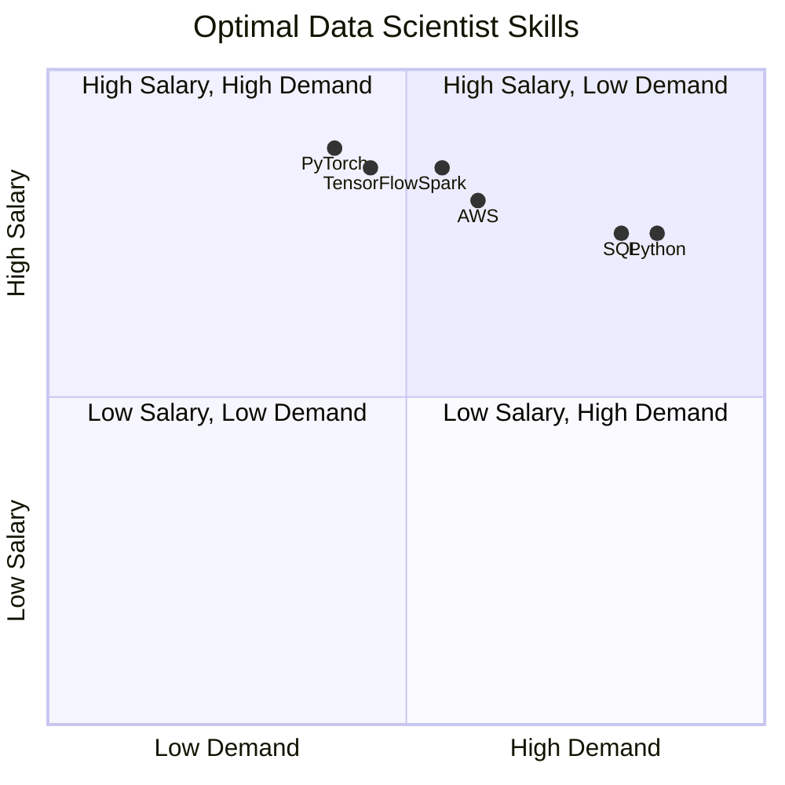

# Data Scientist Job Market Analysis (SQL)

## Introduction

This project analyzes the **Data Scientist job market** using SQL to uncover:

* The **highest-paying Data Scientist roles**
* Skills required for **top-paying positions**
* Skills that are **high in demand**, **high paying**, and therefore **optimal to learn**

The project demonstrates strong **SQL proficiency**, **analytical reasoning**, and the ability to transform raw job posting data into **actionable insights for recruiters and candidates**.

---

## Background

Data Scientist compensation varies significantly based on:

* Seniority level
* Skill specialization
* Market demand
* Role flexibility (remote vs on-site)

Understanding these factors helps:

* **Recruiters** benchmark salaries and identify skill gaps
* **Candidates** prioritize learning paths that maximize employability and compensation

This analysis focuses only on roles with **explicit salary data** to ensure accuracy.

---

## Tools I Used

* **SQL (PostgreSQL syntax)**

  * Common Table Expressions (CTEs)
  * Multi-table joins
  * Aggregations and ranking
* **Relational datasets**

  * Job postings (`job_postings_fact`)
  * Company metadata (`company_dim`)
  * Job-skill mappings (`skills_job_dim`)
  * Skill reference table (`skills_dim`)

---

## Key Skills Demonstrated

### Technical Skills

* Advanced SQL (CTEs, JOINs, GROUP BY, ORDER BY)
* Relational data modeling (fact & dimension tables)
* Aggregation metrics (demand & salary analysis)

### Analytical & Business Skills

* Labor-market trend analysis
* Compensation benchmarking
* Demand vs value trade-off evaluation

### Professional Skills

* Clear technical documentation
* Recruiter-focused insight communication
* Portfolio-ready GitHub presentation

---

## The Analysis

---

### 1. Top-Paying Data Scientist Jobs

#### 📊 Top 10 Salaries (Remote Roles)



#### 🔍 Insights

* **Senior and leadership roles dominate top compensation**
* All top roles are **fully remote**
* Quantitative and business-focused roles command the highest salaries
* Compensation increases sharply with **seniority + specialization**

---

### 2. Skills Required for Top-Paying Jobs

#### 🧠 Skill Presence in Top Salaries



#### 🔍 Insights

* **SQL and Python are universal requirements**
* High-paying roles combine:

  * Data engineering (Spark, Hadoop)
  * Backend systems (Java, Cassandra)
  * Analytics & visualization (Tableau)
* Indicates preference for **full-stack data scientists**

---

### 3. Most In-Demand Skills (Market-Wide)

#### 📈 Demand Ranking by Job Count

```mermaid
bar
  title Most In-Demand Data Scientist Skills
  x-axis Skills
  y-axis Number of Jobs
  "Python" : 114016
  "SQL" : 79174
  "R" : 59754
  "SAS" : 29642
  "Tableau" : 29513
```

#### 🔍 Insights

* Python and SQL dominate hiring demand
* R remains highly relevant
* BI and statistical tools continue to matter
* High demand does **not always imply highest salary**

---

### 4. Highest-Paying Skills (Average Salary)

#### 💰 Salary-Driven Ranking

```mermaid
bar
  title Highest-Paying Skills (Average Salary)
  x-axis Skills
  y-axis Avg Salary
  "Asana" : 215477
  "Airtable" : 201143
  "RedHat" : 189500
  "Watson" : 187417
  "Elixir" : 170824
```

#### 🔍 Insights

* Niche and enterprise tools command premium salaries
* These skills are less common but signal **specialized roles**
* Salary ≠ popularity

---

### 5. Most Optimal Skills (High Demand + High Pay)

#### 🎯 Skill Optimization Matrix



#### 📊 Optimal Skills Summary

| Skill      |  Jobs | Avg Salary |
| ---------- | ----: | ---------: |
| Python     | 4,312 |      $138K |
| SQL        | 3,151 |      $138K |
| Spark      |   946 |      $144K |
| TensorFlow |   641 |      $143K |
| PyTorch    |   564 |      $146K |
| AWS        | 1,016 |      $139K |
| Scala      |   381 |      $145K |
| Go         |   316 |      $147K |

#### 🔍 Insights

* **Python & SQL** sit firmly in the high-demand / high-pay quadrant
* ML frameworks increase salary even with lower demand
* Distributed systems & cloud skills significantly boost compensation
* Best strategy: **core skills + specialization**

---

## What I Learned

* Seniority and specialization drive compensation more than tool count
* Demand ensures employability; specialization increases salary
* SQL CTEs greatly improve readability and analytical flow
* Correct join logic is essential to avoid inflated metrics

---

## Conclusions

This project demonstrates the ability to:

* Perform advanced SQL analysis on real-world datasets
* Identify market trends in skills, demand, and compensation
* Translate raw data into **recruiter-relevant insights**

### Recruiter Takeaway

This repository showcases:

* Strong SQL fundamentals
* Business-oriented analytical thinking
* Clear technical communication
* Portfolio-ready documentation

---

### 📌 Future Enhancements

* Interactive dashboard (Tableau / Power BI)
* Time-series salary trends
* Role-specific comparisons (Analyst vs Scientist)
* Geographic compensation analysis

---


